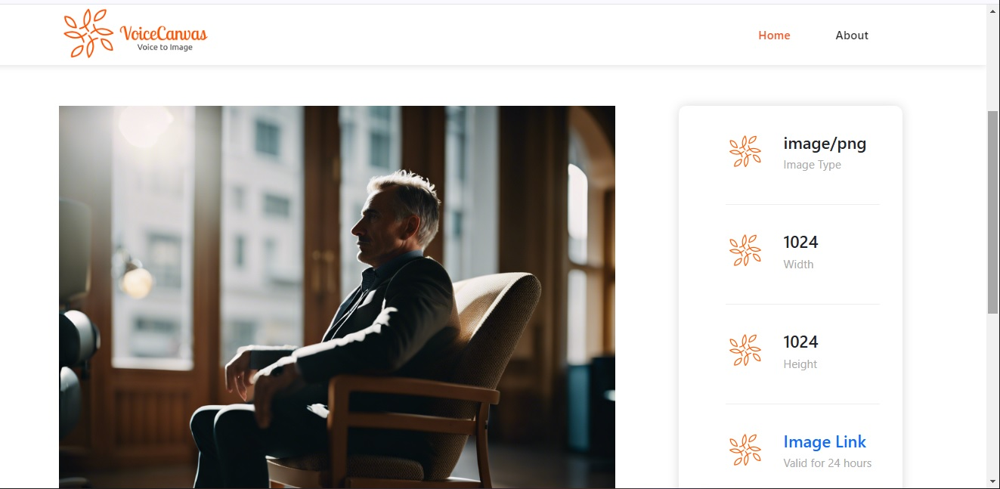

# VoiceCanvas - README

VoiceCanvas is an AI-based image generation tool that uses an audio description of the desired image to generate an image for the user

## Table of Contents

- [Overview](#overview)
- [Setup](#setup)
  - [Prerequisites](#prerequisites)
  - [Installation](#installation)
- [Usage](#usage)
- [Screenshots](#screenshots)
- [Tech Stack](#tech-stack)
- [Future Updates](#future-updates)
- [License](#license)

## Overview
The VoiceCanvas app has a simple linear workflow. A user provides audio input using a microphone. This audio is captured and processed into text. The text transcript of the audio is then fed into an AI image generator to render an AI image.
The app currently uses the browser's inbuilt speech recognition module to handle speech input and transcript. AI image generation is done by integrating the limewire AI image generation API.

## Setup

Follow these steps to set up the app on your server.

### Prerequisites

1. Web Server with support for PHP and PHP cUrl module enabled.
2. Web browser with support for web speech recognition API (e.g Chrome or Safari browsers)
3. [Limewire](https://limewire.com) API key for the image generator (Limewire has a free API key option).

### Installation

1. Clone or download the repository files:

2. Copy the repository files to your web server's http/web folder.

3. Configure the image API settings: open the config.php file in an editor and change the API_KEY paramater to match your Limewire API key.

## Usage

1. Open your web browser and navigate to the app's URL.

2. To generate an image, click on the "Create New" Button at the top-right of the home page.
3. Using your connected microphone, give an audio description of the image you wish to generate.
4. Click on the "Next step" button and your image will be generated and displayed.

## Screenshots

The following are some screenshots of the app.

## Tech Stack

The app is built using a combination of different web technologies. These include:

- **PHP**
- **HTML**
- **Javascript**

## Future Updates

Features to be added in the future include
1. Configuration panel to allow the user to tweak the image parameters such as quality, style, etc.
2. Alternate input option for browsers that lack support for audio input.
3. Option to edit audio transcript before image generation.

## License

This project is licensed under the [GPL-3.0 License](LICENSE).

---
